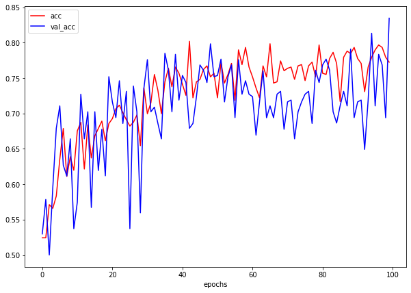

# CarClassifierDeTectTechnologies
used Transfer Learning(VGG16) to classify between two cars. Basically, It was an assignment given by Detect Technologies to test my Machine Learning skills.

## Training & Validation Accuracy

## Training & Validation Loss

